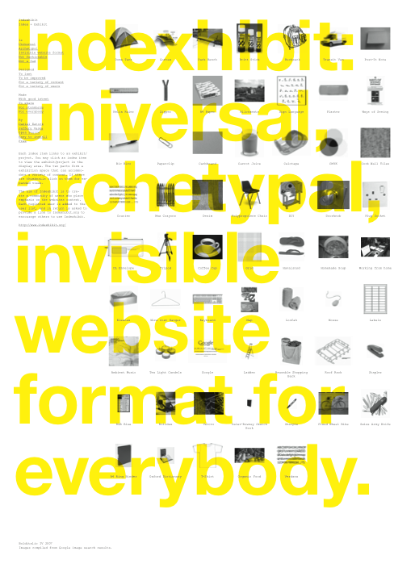

<!--
Este archivo README esta generado automaticamente<https://github.com/YunoHost/apps/tree/master/tools/readme_generator>
No se debe editar a mano.
-->

# Indexhibit para Yunohost

[](https://dash.yunohost.org/appci/app/indexhibit)  

[](https://install-app.yunohost.org/?app=indexhibit)

*[Leer este README en otros idiomas.](./ALL_README.md)*

> *Este paquete le permite instalarIndexhibit rapidamente y simplement en un servidor YunoHost.*  
> *Si no tiene YunoHost, visita [the guide](https://yunohost.org/install) para aprender como instalarla.*

## Descripción general

Indexhibit is a pioneering, influential, web-based content management system (CMS), founded in 2006 by Jeffery Vaska and Daniel Eatock, which is used primarily to create online portfolios (image, text and video).
It is intended for independent-minded creators, academics, researchers, students, collectors, et al., who wish to learn how and manage the visual display of their works, on their own terms, according to their own abilities.


**Versión actual:** 2.1.2024.02.07~ynh1

## Capturas



## Documentaciones y recursos

- Sitio web oficial: <https://www.indexhibit.org>
- Documentación administrador oficial: <https://forum.indexhibit.org/tutorials/getting-started/installation/>
- Repositorio del código fuente oficial de la aplicación : <https://github.com/Indexhibit/indexhibit>
- Catálogo YunoHost: <https://apps.yunohost.org/app/indexhibit>
- Reportar un error: <https://github.com/YunoHost-Apps/indexhibit_ynh/issues>

## Información para desarrolladores

Por favor enviar sus correcciones a la [`branch testing`](https://github.com/YunoHost-Apps/indexhibit_ynh/tree/testing

Para probar la rama `testing`, sigue asÍ:

```bash
sudo yunohost app install https://github.com/YunoHost-Apps/indexhibit_ynh/tree/testing --debug
o
sudo yunohost app upgrade indexhibit -u https://github.com/YunoHost-Apps/indexhibit_ynh/tree/testing --debug
```

**Mas informaciones sobre el empaquetado de aplicaciones:** <https://yunohost.org/packaging_apps>
