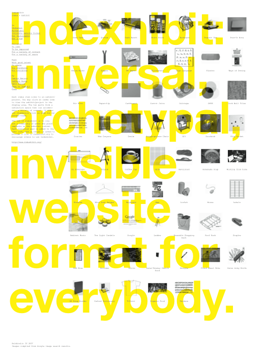

<!--
Nota bene : ce README est automatiquement généré par <https://github.com/YunoHost/apps/tree/master/tools/readme_generator>
Il NE doit PAS être modifié à la main.
-->

# Indexhibit pour YunoHost

[](https://dash.yunohost.org/appci/app/indexhibit)  

[](https://install-app.yunohost.org/?app=indexhibit)

*[Lire le README dans d'autres langues.](./ALL_README.md)*

> *Ce package vous permet d’installer Indexhibit rapidement et simplement sur un serveur YunoHost.*  
> *Si vous n’avez pas YunoHost, consultez [ce guide](https://yunohost.org/install) pour savoir comment l’installer et en profiter.*

## Vue d’ensemble

Indexhibit est un système de gestion de contenu (CMS) pionnier et influent basé sur le Web, fondé en 2006 par Jeffery Vaska et Daniel Eatock, qui est principalement utilisé pour créer des portfolios en ligne (image, texte et vidéo).
Il s'adresse aux créateurs indépendants d'esprit, universitaires, chercheurs, étudiants, collectionneurs, etc., qui souhaitent apprendre et gérer la présentation visuelle de leurs œuvres, à leur manière, selon leurs propres capacités.

**Version incluse :** 2.1.2024.03.26~ynh1

## Captures d’écran



## Documentations et ressources

- Site officiel de l’app : <https://www.indexhibit.org>
- Documentation officielle de l’admin : <https://forum.indexhibit.org/tutorials/getting-started/installation/>
- Dépôt de code officiel de l’app : <https://github.com/Indexhibit/indexhibit>
- YunoHost Store : <https://apps.yunohost.org/app/indexhibit>
- Signaler un bug : <https://github.com/YunoHost-Apps/indexhibit_ynh/issues>

## Informations pour les développeurs

Merci de faire vos pull request sur la [branche `testing`](https://github.com/YunoHost-Apps/indexhibit_ynh/tree/testing).

Pour essayer la branche `testing`, procédez comme suit :

```bash
sudo yunohost app install https://github.com/YunoHost-Apps/indexhibit_ynh/tree/testing --debug
ou
sudo yunohost app upgrade indexhibit -u https://github.com/YunoHost-Apps/indexhibit_ynh/tree/testing --debug
```

**Plus d’infos sur le packaging d’applications :** <https://yunohost.org/packaging_apps>
